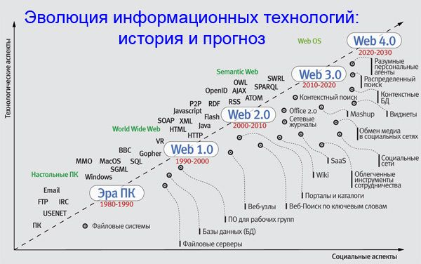
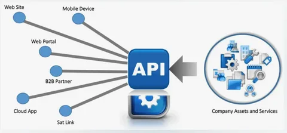

### **Модуль 1. Введение в API и сетевые технологии**

**Цель:** Дать общее понимание API, их роли в современной разработке и связи с другими модулями курса.

---
# История веба




## 1. Что такое API?

### **1.1 Определение**

**API (Application Programming Interface)** — это набор правил и инструментов, позволяющий разным программам взаимодействовать между собой.


**Аналогия из жизни:**

> API — как официант в ресторане:
>
> - Вы (клиент) делаете **запрос** («Я хочу пиццу»)
> - Официант (API) передает его **кухне** (серверу)
> - Кухня готовит и возвращает **ответ** через официанта

### **1.2 Примеры API в реальном мире**

| **Сервис**          | **Что делает API**                                         |
| ------------------------------- | ------------------------------------------------------------------------- |
| Google Maps                     | Возвращает координаты или маршруты         |
| Twitter                         | Позволяет публиковать твиты программно |
| Погодные сервисы | Предоставляет данные о температуре         |



**Практическое задание:**
Откройте [JSONPlaceholder](https://jsonplaceholder.typicode.com/) (фейковый API) и выполните в браузере:

```
https://jsonplaceholder.typicode.com/posts/1
```

Посмотрите, как API возвращает данные в формате JSON.

---

## **2. Зачем нужны API?**


API (Application Programming Interface) — это набор правил и инструментов, который позволяет разным программам взаимодействовать друг с другом.  

### **Зачем нужны API?**  
1. **Обмен данными между приложениями**  
   - Например, сайт погоды использует API метеорологической службы, чтобы показывать актуальные данные.  
   - Соцсети (ВКонтакте, Telegram) предоставляют API для интеграции с другими сервисами.  

2. **Упрощение разработки**  
   - Вместо того чтобы писать код с нуля, разработчики используют готовые API (например, платежные системы, карты, авторизация через Google/Facebook).  

3. **Автоматизация процессов**  
   - Компании используют API для связи внутренних систем (например, CRM и бухгалтерской программы).  
   - Боты в Telegram работают через Bot API.  

4. **Доступ к сложным функциям**  
   - Например, API нейросетей (ChatGPT, Midjourney) позволяет встраивать ИИ в свои приложения.  

5. **Безопасность**  
   - API позволяет давать доступ к данным без раскрытия внутренней логики системы (например, банковские переводы через сторонние приложения).  

### **Примеры популярных API**  
- **Google Maps API** – встраивание карт на сайт.  
- **Twitter API** – получение твитов, публикация постов.  
- **OpenWeatherMap API** – доступ к погодным данным.  
- **Stripe/PayPal API** – прием платежей.  

**Вывод:** API экономят время, расширяют возможности приложений и позволяют разным сервисам работать вместе. 

### **2.1 Основные преимущества**

- **Разделение ответственности:** Фронтенд и бэкенд работают независимо.
- **Масштабируемость:** Можно обновлять части системы без переделки всего кода.
- **Интеграция:**
  Сторонние сервисы (платежи, аутентификация) подключаются через API.

### **2.2 Типы API**

- **Публичные (OpenAPI):** Доступны всем (например, API GitHub).
- **Внутренние:** Используются только внутри компании.
- **Партнерские:** Для избранных интеграций (например, API для поставщиков).

**Дискуссия:**
*Какие API вы используете в своих проектах?*

---

## **3. О чем этот курс?**

### **3.1 Обзор модулей**

| **Модуль**                      | **Что изучим**                             | **Зачем это нужно?**                                |
| ------------------------------------------- | --------------------------------------------------------- | ---------------------------------------------------------------------- |
| 2. Как работает интернет | HTTP, DNS, IP-адреса                                | Понимать, как данные передаются в сети |
| 3. Виды API                             | REST, SOAP, RPC, GraphQL, gRPC                            | Выбирать правильный тип API для задачи   |
| 4–7. Проектирование API      | Практика с разными протоколами | Создавать эффективные и надежные API      |

### **3.2 Инструменты курса**

- **Для тестирования:** Postman, cURL
- **Для разработки:** Python (FastAPI, gRPC, Strawberry для GraphQL)
- **Для анализа:** Wireshark (разбор сетевых пакетов)

**Демонстрация:**
Покажем, как выглядит общение через API на примере простого REST-запроса:

```bash

curl -X GET https://api.github.com/users/octocat
curl.exe https://api.github.com/users/octocat
iwr "https://api.github.com/users/octocat"
irm -Headers @{"Accept"="application/json"} "https://api.github.com/users/octocat"
```

---

.

## 🧠 Что такое API технически?

**API (Application Programming Interface)** — это **интерфейс**, через который одна программа (или модуль) может **вызывать функции**, **отправлять/получать данные** и **взаимодействовать с другой программой**.

Это может быть:

* **Локальное API** — когда модули одного приложения взаимодействуют между собой.
* **Web API** (или HTTP API / REST API / GraphQL и т.д.) — когда программы общаются через интернет по HTTP.

---

## 🧩 Из чего состоит API?

API обычно включает:

* **Методы (эндпоинты)** — функции, которые можно вызывать, например:
  `GET /users`, `POST /login`, `PUT /product/123`
* **Параметры** — данные, которые ты передаёшь в запросе.
* **Ответы** — данные, которые ты получаешь от API (чаще всего в формате JSON или XML).
* **Коды состояния HTTP** — например:
  `200 OK`, `404 Not Found`, `500 Internal Server Error`.

---

## 🔁 Пример REST API запроса

Допустим, у нас есть API интернет-магазина.
Ты хочешь получить список товаров.

```http
GET https://api.shop.com/products
```

Ответ:

```json
[
  {
    "id": 1,
    "name": "Кофеварка",
    "price": 5990
  },
  {
    "id": 2,
    "name": "Чайник",
    "price": 2490
  }
]
```

Если хочешь добавить товар:

```http
POST https://api.shop.com/products
Content-Type: application/json

{
  "name": "Тостер",
  "price": 3290
}
```

---

## 🧱 Виды API

* **REST API** — работает через HTTP, использует методы GET, POST, PUT, DELETE и т.д. (самый популярный сейчас).
* **GraphQL API** — более гибкий, клиент сам выбирает, какие поля ему нужны.
* **gRPC** — быстрый двоичный протокол, чаще используется в микросервисах.
* **WebSocket API** — для постоянного соединения и обмена данными в реальном времени (например, чаты, биржи).

---

## 📦 Пример на коде (Python, requests)

```python
import requests

response = requests.get("https://api.shop.com/products")
if response.status_code == 200:
    products = response.json()
    for product in products:
        print(product["name"], "-", product["price"])
```

---


## **5. Домашнее задание**

1. **Теоретическое:** Найти 3 публичных API (не из примера), описать их назначение.
2. **Практическое:** Сделать GET-запрос к [API SpaceX](https://docs.spacexdata.com/) и сохранить ответ в файл.
3. **Вопрос для размышления:**
   *Почему компании часто запрещают публичный доступ к своим API?*

---

## **6. Дополнительные материалы**

- [Что такое API? (простыми словами)](https://habr.com/ru/companies/ruvds/articles/464949/)
- [Список публичных API](https://github.com/public-apis/public-apis)
- [HTTP в деталях (Mozilla)](https://developer.mozilla.org/ru/docs/Web/HTTP)

```
https://api.spacexdata.com/v4/dragons

```


# API без традиционных эндпоинтов (URL-адресов)  

### **1. API без HTTP-эндпоинтов (не веб-API)**  
Некоторые API вообще не используют HTTP-запросы и, соответственно, не имеют эндпоинтов в классическом понимании:  

- **Локальные API (библиотеки)**  
  - Например, API операционной системы (WinAPI, POSIX) или языковые библиотеки (Python's `requests`, Java's `Collections`).  
  - Вызываются напрямую через код, без сетевых запросов.  

- **API драйверов устройств**  
  - Например, взаимодействие с видеокартой (Vulkan, OpenGL) или принтером.  
  - Работает через системные вызовы, а не HTTP.  

- **IPC (Inter-Process Communication)**  
  - Например, API для обмена данными между процессами (gRPC, GraphQL over WebSockets, Unix Sockets).  

### **2. Веб-API без фиксированных эндпоинтов**  
Даже в вебе есть API, где эндпоинты не жестко заданы, а динамически формируются:  

- **GraphQL**  
  - Обычно есть один эндпоинт (например, `/graphql`), а запросы отличаются телом запроса (не разными URL).  

- **RPC-API (JSON-RPC, XML-RPC, gRPC)**  
  - Часто используется один URL (например, `/rpc`), а действие определяется параметрами.  

- **Событийные API (WebSockets, Webhooks)**  
  - Нет множества эндпоинтов — данные приходят по одному каналу или через колбэки.  

### **Вывод**  
Традиционные REST/SOAP API используют эндпоинты, но многие современные технологии (библиотеки, GraphQL, gRPC, WebSockets) либо обходятся без них, либо сводят всё к одному URL.  


# Вопросы

#### **1. Техническая глубина API**  
**Вопрос:**  
*Как технически реализуется API на уровне операционной системы или языка программирования? Приведите пример низкоуровневого API (например, WinAPI или системных вызовов Linux) и объясните, чем он отличается от веб-API.*  

**Ответ:**  
Низкоуровневые API, такие как WinAPI или POSIX в Linux, работают через **системные вызовы** (syscalls), которые обращаются напрямую к ядру ОС. Например:  
- В Linux вызов `open()` для чтения файла — это API-функция, которая преобразуется в ассемблерную инструкцию (например, `syscall` на x86).  
- В Windows WinAPI предоставляет функции вроде `CreateFile()`, которые взаимодействуют с драйверами устройств.  

**Отличие от веб-API:**  
- Нет HTTP-запросов, данные передаются через **регистры процессора** или **разделяемую память**.  
- Не требуют сети, работают на уровне процессов/потоков.  

---  

#### **2. Безопасность и ограничения API**  
**Вопрос:**  
*Почему многие компании ограничивают доступ к своим публичным API (например, Twitter API)? Какие механизмы они используют для контроля (например, rate limiting, OAuth)? Как это влияет на архитектуру клиентских приложений?*  

**Ответ:**  
**Причины ограничений:**  
- **Злоупотребление ресурсами** (DDoS, парсинг данных).  
- **Монетизация** (платный доступ, как у Google Maps API).  
- **Конфиденциальность** (например, банковские API).  

**Механизмы контроля:**  
- **Rate Limiting** (ограничение запросов в минуту).  
- **OAuth 2.0** для авторизации.  
- **Платные ключи доступа (API keys)**.  

**Влияние на архитектуру:**  
- Клиенты должны реализовывать **кеширование**, **очереди запросов** и **обработку ошибок 429 Too Many Requests**.  

---  

#### **3. Эволюция API**  
**Вопрос:**  
*Как исторически развивались API (от SOAP к REST, GraphQL и gRPC)? Какие проблемы каждого подхода решили последующие технологии?*  

**Ответ:**  
- **SOAP (2000s)**: XML, строгая типизация, сложность.  
  **Проблема**: Избыточность, низкая производительность.  
- **REST (2010s)**: JSON, HTTP-методы, простота.  
  **Проблема**: Over-fetching/under-fetching данных.  
- **GraphQL**: Гибкие запросы, один эндпоинт.  
  **Проблема**: Сложность кеширования.  
- **gRPC**: Бинарный протокол (Protocol Buffers), высокая скорость.  
  **Проблема**: Неудобен для браузеров.  

---  

#### **4. API без эндпоинтов**  
**Вопрос:**  
*Какие существуют API, которые вообще не используют HTTP или URL-эндпоинты? Приведите примеры и объясните, как они работают (например, IPC, WebSockets, драйверы устройств).*  

**Ответ:**  
- **IPC (Inter-Process Communication)**:  
  - **Unix Sockets** или **Named Pipes** — обмен данными между процессами на одной машине.  
- **WebSockets**:  
  - Постоянное соединение через `ws://`, данные передаются в реальном времени (чаты, игры).  
- **Драйверы устройств**:  
  - API видеокарты (Vulkan) вызывает функции GPU через драйвер, минуя сеть.  

---  

#### **5. Будущее API**  
**Вопрос:**  
*Какие тренды в разработке API будут доминировать в ближайшие 5 лет? Рассмотрите технологии вроде API на основе ИИ (как OpenAI), серверных событий (SSE), квантовых API.*  

**Ответ:**  
- **ИИ-интегрированные API**:  
  - ChatGPT API позволяет встраивать ИИ в приложения.  
- **Серверные события (SSE)**:  
  - Альтернатива WebSockets для одностороннего потока данных.  
- **Квантовые API**:  
  - Например, IBM Quantum API для доступа к квантовым компьютерам.  
- **Wasm (WebAssembly)**:  
  - API для выполнения бинарного кода в браузере с near-native скоростью.  

