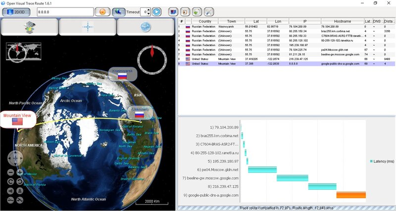
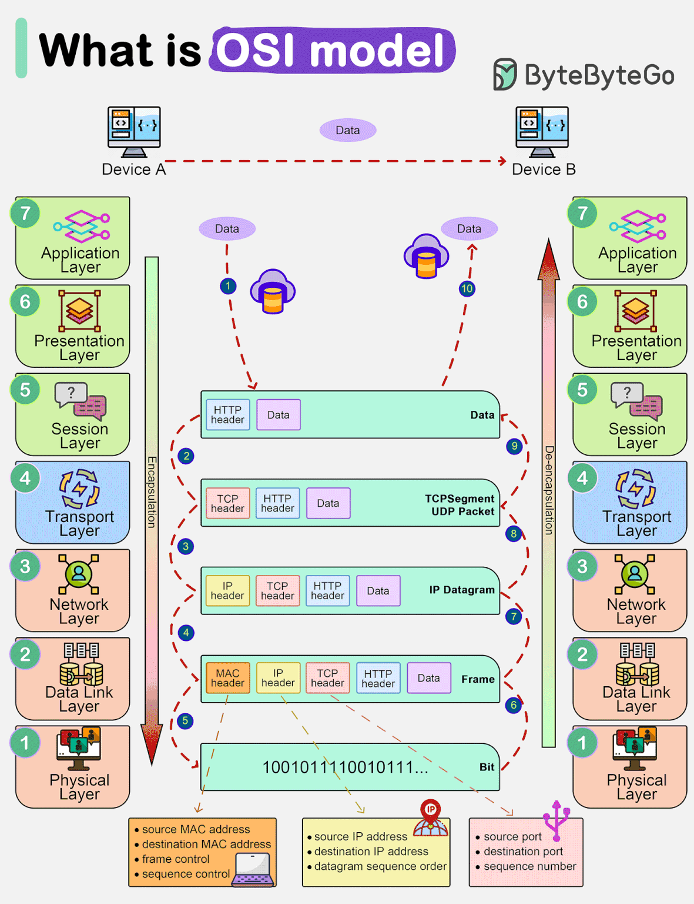
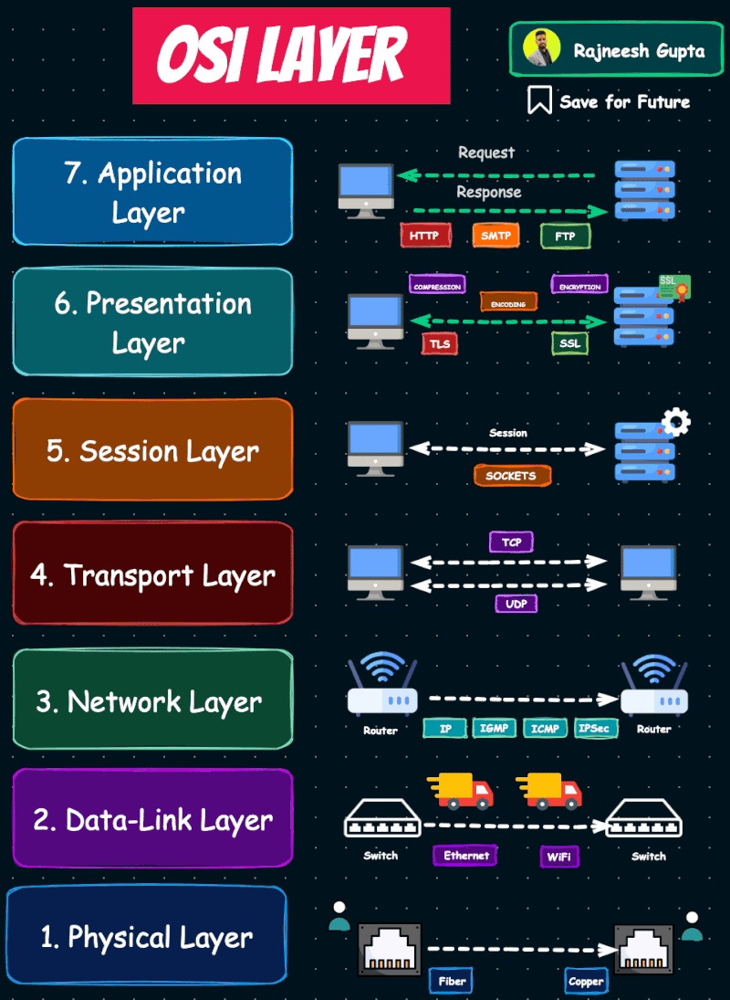
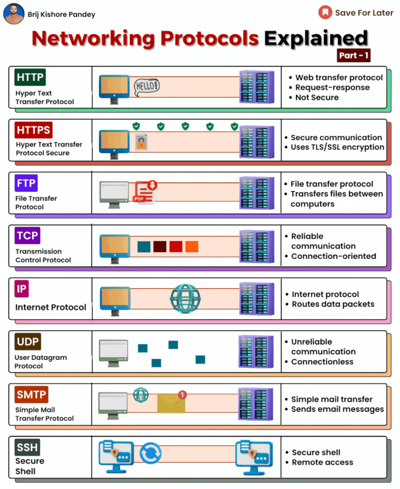
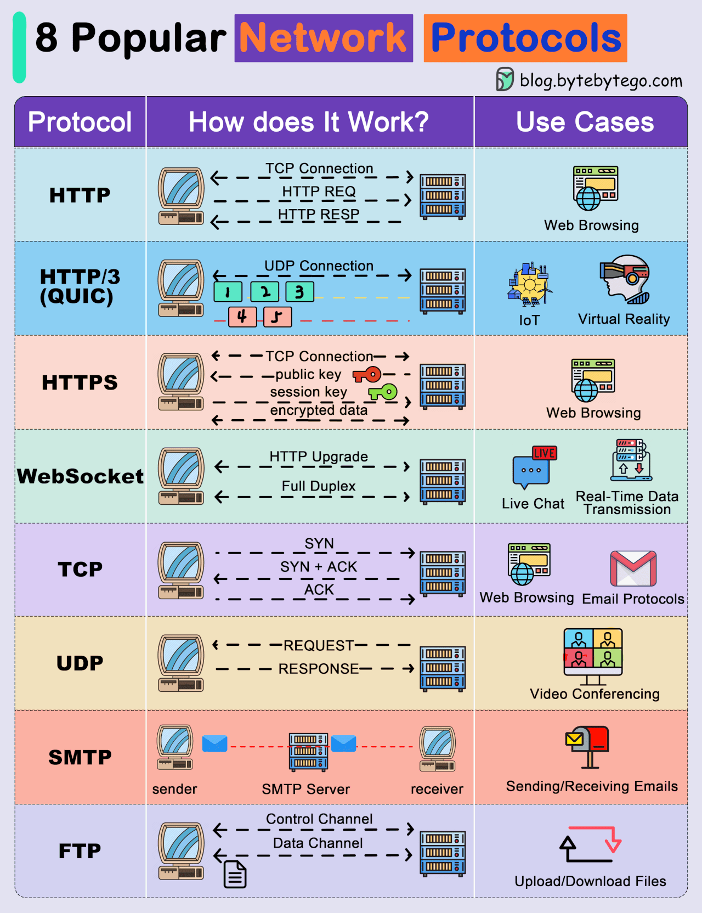
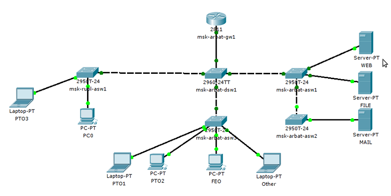

### **Модуль 2: Как работает интернет: HTTP, DNS, IP-адреса**

---



## **1. Базовые понятия**




### **1.1 IP-адреса: "Почтовые адреса" интернета**

- **IPv4:** 32-битный адрес (например, `192.168.1.1`)
- **IPv6:** 128-битный адрес (например, `2001:0db8:85a3::8a2e:0370:7334`)

**Как узнать свой IP?**

```bash
# Windows:
ipconfig

# Linux/macOS:
ifconfig | grep "inet "
```

### **1.2 DNS: Телефонная книга интернета**

Преобразует домены (например, `google.com`) в IP-адреса.

**Пример работы DNS:**

1. Вы вводите `youtube.com` в браузере
2. Компьютер запрашивает у DNS-сервера IP-адрес
3. DNS возвращает `172.217.0.46`
4. Браузер подключается к этому IP

**Проверим DNS:**

```bash
nslookup google.com
# Или:
dig google.com
ping google.com

```

---

## **2. HTTP: Язык общения в интернете **



### **Модель OSI для Python-разработчика: просто о сложном**  

Модель OSI (Open Systems Interconnection) — это **7-уровневая абстракция**, объясняющая, как данные передаются по сети. Python-программисту она помогает понять, на каком уровне возникают ошибки (например, "Connection refused" или "SSL handshake failed") и как работают библиотеки типа `requests`, `socket` или `asyncio`.

---

## **1. Зачем Python-разработчику знать OSI?**  
- **Дебаггинг сетевых проблем**: Понять, где обрывается соединение — на уровне DNS (уровень 7) или TCP (уровень 4).  
- **Выбор инструментов**:  
  - `requests` работает на **уровне 7 (HTTP)**,  
  - `socket` — на **уровнях 3–4 (IP/TCP)**,  
  - `scapy` — позволяет работать с **уровнями 2–3 (Ethernet/IP)**.  
- **Оптимизация**: Например, замена HTTP/1.1 на HTTP/2 (уровень 7) или выбор между TCP и UDP (уровень 4).

---

## **2. Уровни OSI и их аналоги в Python**  

| №  | Уровень OSI       | Пример из мира Python                          | Что важно?                                                                 |
|----|-------------------|-----------------------------------------------|----------------------------------------------------------------------------|
| 7  | **Приложений**    | `requests`, `aiohttp`, Flask/Django           | HTTP, REST API, WebSockets, JSON/XML.                                      |
| 6  | **Представления** | `json`, `pickle`, `cryptography`              | Шифрование, сжатие, сериализация данных.                                   |
| 5  | **Сеансовый**     | `websockets`, `ssh`-сессии                    | Поддержка длительных соединений (например, аутентификация).                |
| 4  | **Транспортный**  | `socket`, `asyncio`, TCP/UDP                  | Порты, гарантия доставки (TCP) или скорость (UDP).                         |
| 3  | **Сетевой**       | `scapy`, `ping3`, роутеры                     | IP-адреса, маршрутизация.                                                 |
| 2  | **Канальный**     | Драйверы сетевых карок (`nfqueue`)            | MAC-адреса, Ethernet/Wi-Fi.                                               |
| 1  | **Физический**    | Кабели, сигналы Wi-Fi                         | Биты, электрические/оптические сигналы.                                    |

---

## **3. Примеры кода для разных уровней**  

### **Уровень 7 (HTTP) — `requests`**  
```python
import requests
response = requests.get("https://api.github.com")  # HTTP-запрос (уровень 7)
print(response.json())
```

### **Уровень 4 (TCP) — `socket`**  
```python
import socket
s = socket.socket(socket.AF_INET, socket.SOCK_STREAM)  # TCP (уровень 4)
s.connect(("google.com", 80))
s.send(b"GET / HTTP/1.1\r\nHost: google.com\r\n\r\n")
print(s.recv(4096))
```

### **Уровень 3 (IP) — `scapy`**  
```python
from scapy.all import *
packet = IP(dst="8.8.8.8")/ICMP()  # Пинг (уровень 3)
response = sr1(packet, timeout=2)
print(response)
```

---

## **4. Типичные проблемы и на каких уровнях искать**  
1. **"Connection refused"** → Уровень 4 (порт закрыт) или 7 (сервер отверг запрос).  
2. **"SSL certificate failed"** → Уровень 6 (проблема с шифрованием).  
3. **Медленная загрузка данных** → Уровень 4 (TCP-буфер) или 7 (HTTP/1.1 без сжатия).  
4. **"DNS resolution failed"** → Уровень 7 (проблема с доменным именем).  

---

## **5. Как запомнить порядок уровней?**  
Мнемоника: **"Все Программисты Спят, Только Сетевые Калеки Фиксируют"**  
1. **В**изит (Приложений)  
2. **П**ациента (Представления)  
3. **С**танции (Сеансовый)  
4. **Т**ребует (Транспортный)  
5. **С**рочно (Сетевой)  
6. **К**офе (Канальный)  
7. **Ф**иксировать (Физический)  

---

## **Вывод**  
Python-разработчику не нужно глубоко разбираться в уровнях 1–2 (если вы не пишете драйверы), но понимание **уровней 3–7** критично для:  
- Отладки сетевых ошибок,  
- Выбора правильных библиотек,  
- Оптимизации скорости и безопасности.  

**Совет**: Начните с `requests` (уровень 7) и `socket` (уровень 4) — этого хватит для 90% задач.




### **Сетевые протоколы для Python-разработчика**  
Сетевые протоколы — это «правила общения» программ в сети. Python-разработчик сталкивается с ними ежедневно: от HTTP-запросов до низкоуровневых TCP-сокетов. Разберём ключевые протоколы и их применение в Python.

---

## **1. Основные протоколы и где они используются**  
### **1.1. Прикладной уровень (уровень 7 OSI)**  
#### **HTTP/HTTPS**  
- **Для чего**: Веб-запросы, REST API, загрузка данных.  
- **Python-библиотеки**: `requests`, `aiohttp`, `httpx`.  
```python
import requests
response = requests.get("https://api.github.com")
print(response.json())
```

#### **WebSocket**  
- **Для чего**: Чат, онлайн-игры, реальное время (например, биржевые котировки).  
- **Python-библиотеки**: `websockets`, `socket.io`.  
```python
import websockets
async def chat():
    async with websockets.connect("ws://echo.websocket.org") as ws:
        await ws.send("Hello!")
        print(await ws.recv())
```

#### **FTP/SFTP**  
- **Для чего**: Передача файлов.  
- **Python-библиотеки**: `ftplib`, `paramiko` (SFTP).  
```python
from ftplib import FTP
ftp = FTP("ftp.example.com")
ftp.login("user", "password")
ftp.retrbinary("RETR file.txt", open("file.txt", "wb").write)
```

---

### **1.2. Транспортный уровень (уровень 4 OSI)**  
#### **TCP**  
- **Для чего**: Надёжная передача данных (гарантирует доставку).  
- **Python-библиотеки**: `socket`.  
```python
import socket
s = socket.socket(socket.AF_INET, socket.SOCK_STREAM)  # TCP
s.connect(("google.com", 80))
s.send(b"GET / HTTP/1.1\r\nHost: google.com\r\n\r\n")
print(s.recv(4096).decode())
```

#### **UDP**  
- **Для чего**: Быстрая, но ненадёжная передача (стриминг, VoIP).  
- **Python-библиотеки**: `socket`, `asyncio`.  
```python
s = socket.socket(socket.AF_INET, socket.SOCK_DGRAM)  # UDP
s.sendto(b"Hello!", ("8.8.8.8", 53))  # DNS-запрос
```

---

### **1.3. Сетевой уровень (уровень 3 OSI)**  
#### **IP (IPv4/IPv6)**  
- **Для чего**: Маршрутизация пакетов в сети.  
- **Python-библиотеки**: `socket`, `ipaddress`.  
```python
import ipaddress
ip = ipaddress.IPv4Address("192.168.1.1")
print(ip.is_private)  # True
```

#### **ICMP (ping)**  
- **Для чего**: Проверка доступности хоста.  
- **Python-библиотеки**: `ping3`, `scapy`.  
```python
from ping3 import ping
print(ping("google.com"))  # Время ответа в ms
```

---

## **2. Как выбрать протокол?**  
| **Задача**               | **Протокол**  | **Python-инструменты**       |
|---------------------------|---------------|------------------------------|
| Веб-API                   | HTTP/HTTPS    | `requests`, `aiohttp`        |
| Реальное время (чаты)     | WebSocket     | `websockets`                 |
| Файлообмен                | FTP/SFTP      | `ftplib`, `paramiko`         |
| Надёжная передача данных  | TCP           | `socket`                     |
| Быстрая передача (стримы) | UDP           | `socket`, `asyncio`          |
| Сканирование сети         | ICMP          | `ping3`, `scapy`             |

---

## **3. Типичные проблемы и решения**  
### **3.1. "Connection refused"**  
**Причина**: Порт закрыт или сервер не слушает.  
**Решение**:  
```python
try:
    s.connect(("example.com", 9999))
except ConnectionRefusedError:
    print("Сервер недоступен!")
```

### **3.2. Таймауты в HTTP-запросах**  
**Решение**:  
```python
response = requests.get("https://example.com", timeout=5)  # 5 секунд
```

### **3.3. UDP-пакеты теряются**  
**Причина**: UDP не гарантирует доставку.  
**Решение**:  
- Добавить подтверждения (ACK) на уровне приложения.  
- Или перейти на TCP.  

---

## **4. Дополнительные протоколы**  
- **DNS** (`dnspython`) — преобразование доменов в IP.  
- **SMTP** (`smtplib`) — отправка email.  
- **SSH** (`paramiko`) — безопасное удалённое управление.  
- **gRPC** (`grpc`) — высокопроизводительный RPC (микросервисы).  

```python
import smtplib
server = smtplib.SMTP("smtp.gmail.com", 587)
server.starttls()
server.login("your_email@gmail.com", "password")
server.sendmail("from@example.com", "to@example.com", "Hello!")
```

---

## **5. Что запомнить Python-разработчику?**  
1. **HTTP/HTTPS** — основа веба, учите `requests` и `aiohttp`.  
2. **TCP** — для надёжности, **UDP** — для скорости.  
3. **WebSocket** — если нужно реальное время.  
4. **Проблемы с сетью?** Смотрите:  
   - `ping` (ICMP) → проверка доступности,  
   - `telnet` (TCP) → проверка портов,  
   - `traceroute` → диагностика маршрута.  

**Совет**: Для сложных задач (парсинг пакетов, кастомные протоколы) используйте `scapy`.  

```python
from scapy.all import *
packet = IP(dst="1.1.1.1")/ICMP()
answer = sr1(packet, timeout=2)
answer.show()  # Разбор ответа
```


### **2.1 Как работает HTTP**


- **Клиент** (браузер) отправляет **запрос** → **Сервер** возвращает **ответ**
- Пример запроса:
  ```
  GET /index.html HTTP/1.1
  Host: example.com
  ```



### **2.2 Коды статусов HTTP**

| **Код** | **Значение** | Пример                         |
| ---------------- | -------------------------- | ------------------------------------ |
| 200              | OK                         | Успешный запрос        |
| 404              | Not Found                  | Страница не найдена |
| 500              | Server Error               | Ошибка сервера          |

### **2.3 Демонстрация HTTP-запроса**

**Используем `curl` для "ручного" HTTP-запроса:**

```bash
curl -v https://example.com
```

*В выводе увидите:*

- Заголовки запроса/ответа
- Код статуса (например, `HTTP/2 200`)

---

## **3. Пакеты и маршрутизация**

### **3.1 Как данные путешествуют по сети**

1. Ваш компьютер разбивает данные на **пакеты**
2. Пакеты идут через маршрутизаторы
3. Сервер собирает пакеты обратно

**Аналог:**

> Отправка книги по почте листами в нескольких конвертах

### **3.2 Трассировка маршрута**



Узнаем путь до сервера:

```bash
# Windows:
tracert google.com
Test-NetConnection google.com -TraceRoute
pathping google.com

# Linux/macOS:
traceroute google.com
```

---

## **4. Практическое задание**

### **4.1 Анализ HTTP-запросов**

1. Откройте **Chrome DevTools** (F12) → вкладка **Network**
2. Перейдите на любой сайт
3. Изучите:
   - Заголовки запросов
   - Коды статусов
   - Время загрузки

### **4.2 Эксперимент с DNS**

1. Используйте разные DNS-серверы:
   ```bash
   nslookup google.com 8.8.8.8  # Google DNS
   nslookup google.com 1.1.1.1  # Cloudflare DNS
   ```
2. Сравните скорость ответа

---

## **5. Домашнее задание**

1. **Теоретическое:**

   - Чем отличается TCP от UDP?
   - Как HTTPS обеспечивает безопасность?
2. **Практическое:**

   - Сделать 3 HTTP-запроса через `curl` к разным сайтам, сохранить вывод.
   - Найти IP-адрес своего домашнего роутера.
3. **Эксперимент:**

   - Поменять DNS на `8.8.8.8` в настройках сети → проверить, изменилась ли скорость загрузки сайтов.

---

## **6. Дополнительные материалы**

- [Как работает интернет (интерактивно)](https://howdns.works/)
- [Wireshark для анализа трафика](https://www.wireshark.org/)
- [HTTP/2 и HTTP/3](https://http3-explained.haxx.se/)


### **Эксперимент с DNS: как работают разные DNS-серверы?**  

DNS (Domain Name System) — это "телефонная книга" интернета, которая преобразует доменные имена (например, `google.com`) в IP-адреса (например, `142.250.185.46`).  
Разные DNS-серверы могут:  
- Давать **разные IP** для одного сайта (из-за геолокации, балансировки нагрузки).  
- Отвечать с **разной скоростью**.  
- Фильтровать контент (например, блокировать опасные сайты).  

---

## **1. Как проверить DNS-серверы?**  
Команда `nslookup` позволяет указывать DNS-сервер вручную.  

### **Примеры:**  
#### **(A) Запрос через Google DNS (`8.8.8.8`)**  
```bash
nslookup google.com 8.8.8.8
```
**Вывод:**  
```
Server:  dns.google
Address:  8.8.8.8

Non-authoritative answer:
Name:    google.com
Addresses:  142.250.185.46
          2a00:1450:4010:c0b::66
```
→ Google DNS вернул IPv4 и IPv6 адреса.  

#### **(B) Запрос через Cloudflare DNS (`1.1.1.1`)**  
```bash
nslookup google.com 1.1.1.1
```
**Вывод:**  
```
Server:  one.one.one.one
Address:  1.1.1.1

Non-authoritative answer:
Name:    google.com
Addresses:  142.250.185.46
          2a00:1450:4010:c0b::66
```
→ Cloudflare дал те же IP, но сервер другой.  

---

## **2. Как сравнить скорость DNS-серверов?**  
Можно измерить время ответа с помощью `ping` или `curl`.  

### **Способ 1: Через `ping` (Windows/Linux)**  
```bash
ping 8.8.8.8
ping 1.1.1.1
```
→ Чем меньше `time=... ms`, тем быстрее DNS.  

### **Способ 2: Через `time` + `nslookup` (Linux/macOS)**  
```bash
time nslookup google.com 8.8.8.8
time nslookup google.com 1.1.1.1
```
→ Сравните `real` время выполнения.  

### **Способ 3: Через PowerShell (Windows)**  
```powershell
Measure-Command { nslookup google.com 8.8.8.8 }
Measure-Command { nslookup google.com 1.1.1.1 }
```
→ Посмотрите `TotalMilliseconds`.  

---

## **3. Почему ответы могут отличаться?**  
- **Геолокация** – DNS может выдавать ближайший сервер.  
- **Кеширование** – некоторые провайдеры кешируют DNS-запросы.  
- **Фильтрация** – корпоративные/государственные DNS могут блокировать сайты.  

---

## **4. Какой DNS быстрее?**  
Зависит от вашего местоположения и провайдера.  
Обычно:  
- **Google DNS (`8.8.8.8`)** – стабильный, но иногда медленный.  
- **Cloudflare (`1.1.1.1`)** – часто быстрее, особенно в Европе/США.  
- **OpenDNS (`208.67.222.222`)** – хорошая альтернатива.  

---

## **Вывод эксперимента**  
1. Разные DNS могут давать **одинаковые IP**, но с разной скоростью.  
2. **Cloudflare (`1.1.1.1`)** часто быстрее, чем Google DNS.  
3. Если DNS медленный – можно сменить его в настройках сети.  

**Попробуйте сами:**  
```bash
nslookup youtube.com 8.8.8.8
nslookup youtube.com 1.1.1.1
```  
→ Сравните IP и скорость! 🚀