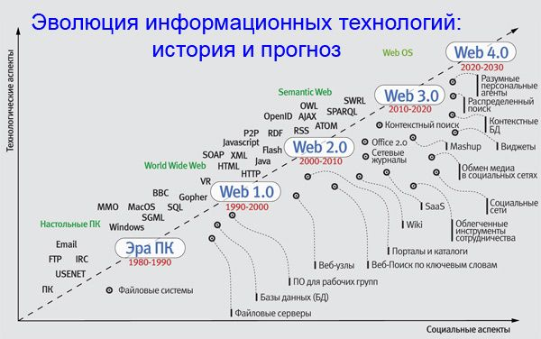

### **Модуль 1. Введение в API и сетевые технологии**


## История веба




## 1. Что такое API

**API (Application Programming Interface)** — это набор правил и инструментов, позволяющий разным программам взаимодействовать между собой.


**Аналогия из жизни:**

> API — как официант в ресторане:
>
> - Вы (клиент) делаете **запрос** («Я хочу пиццу»)
> - Официант (API) передает его **кухне** (серверу)
> - Кухня готовит и возвращает **ответ** через официанта

### **1.2 Примеры API в реальном мире**

| **Сервис**          | **Что делает API**                                         |
| ------------------------------- | ------------------------------------------------------------------------- |
| Google Maps                     | Возвращает координаты или маршруты         |
| Twitter                         | Позволяет публиковать твиты программно |
| Погодные сервисы | Предоставляет данные о температуре         |


---

## **2. Зачем нужны API**


### **2.1 Основные преимущества**

- **Разделение ответственности:** Фронтенд и бэкенд работают независимо.
- **Масштабируемость:** Можно обновлять части системы без переделки всего кода.
- **Интеграция:**
  Сторонние сервисы (платежи, аутентификация) подключаются через API.

### **2.2 Типы API**

- **Публичные (OpenAPI):** Доступны всем (например, API GitHub).
- **Внутренние:** Используются только внутри компании.
- **Партнерские:** Для избранных интеграций (например, API для поставщиков).

**Дискуссия:**
*Какие API вы используете в своих проектах?*

---

## **3. О чем этот курс**

### **3.1 Обзор модулей**

| **Модуль**                      | **Что изучим**                             | **Зачем это нужно?**                                |
| ------------------------------------------- | --------------------------------------------------------- | ---------------------------------------------------------------------- |
| 2. Как работает интернет | HTTP, DNS, IP-адреса                                | Понимать, как данные передаются в сети |
| 3. Виды API                             | REST, SOAP, RPC, GraphQL, gRPC                            | Выбирать правильный тип API для задачи   |
| 4–7. Проектирование API      | Практика с разными протоколами | Создавать эффективные и надежные API      |

### **3.2 Инструменты курса**

- **Для тестирования:** Postman, cURL
- **Для разработки:** Python (FastAPI, gRPC, Strawberry для GraphQL)
- Брокеры сообщений (RabbitMQ, Kafka)
- **Для анализа:** Wireshark (разбор сетевых пакетов)

## 🧠 API технически

**API (Application Programming Interface)** — это **интерфейс**, через который одна программа (или модуль) может **вызывать функции**, **отправлять/получать данные** и **взаимодействовать с другой программой**.

Это может быть:

* **Локальное API** — когда модули одного приложения взаимодействуют между собой.
* **Web API** (или HTTP API / REST API / GraphQL и т.д.) — когда программы общаются через интернет по HTTP.

---

## 🧩 Состав API

API обычно включает:

* **Методы (эндпоинты)** — функции, которые можно вызывать, например:
  `GET /users`, `POST /login`, `PUT /product/123`
* **Параметры** — данные, которые ты передаёшь в запросе.
* **Ответы** — данные, которые ты получаешь от API (чаще всего в формате JSON или XML).
* **Коды состояния HTTP** — например:
  `200 OK`, `404 Not Found`, `500 Internal Server Error`.

---

## 🔁 Пример REST API запроса

Допустим, у нас есть API интернет-магазина.
Ты хочешь получить список товаров.

```http
GET https://api.shop.com/products
```

Ответ:

```json
[
  {
    "id": 1,
    "name": "Кофеварка",
    "price": 5990
  },
  {
    "id": 2,
    "name": "Чайник",
    "price": 2490
  }
]
```

Если хочешь добавить товар:

```http
POST https://api.shop.com/products
Content-Type: application/json

{
  "name": "Тостер",
  "price": 3290
}
```

---

## 📦 Пример на коде (Python, requests)

```python
import requests

response = requests.get("https://api.shop.com/products")
if response.status_code == 200:
    products = response.json()
    for product in products:
        print(product["name"], "-", product["price"])
```

---

## **5. Домашнее задание**

1. **Теоретическое:** Найти 3 публичных API (не из примера), описать их назначение.
2. **Практическое:** Сделать GET-запрос к [API SpaceX](https://docs.spacexdata.com/) и сохранить ответ в файл.
3. **Вопрос для размышления:**
   *Почему компании часто запрещают публичный доступ к своим API?*

---

## **6. Дополнительные материалы**

- [Что такое API? (простыми словами)](https://habr.com/ru/companies/ruvds/articles/464949/)
- [Список публичных API](https://github.com/public-apis/public-apis)
- [HTTP в деталях (Mozilla)](https://developer.mozilla.org/ru/docs/Web/HTTP)

```
https://api.spacexdata.com/v4/dragons

```
